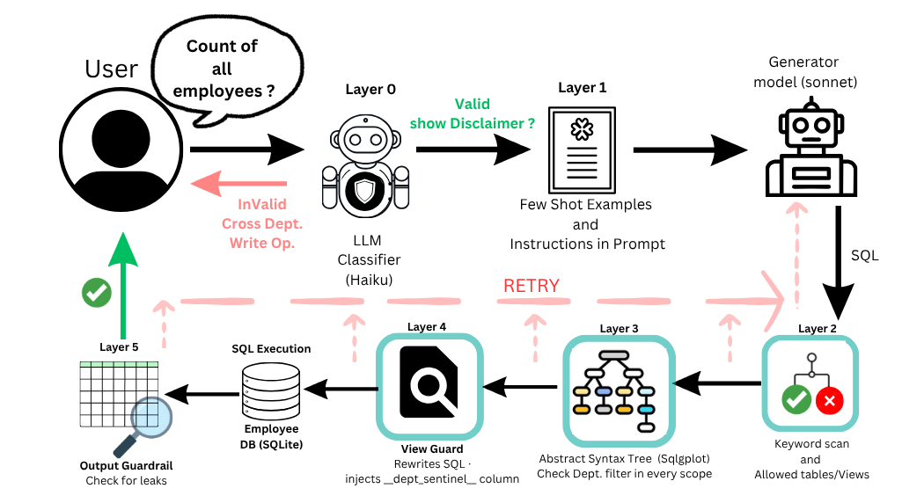

# NL2SQL — Natural Language to SQL Agent

A console-based AI agent that translates natural language questions into SQL queries against an employee database, with a multi-layer guardrail system that enforces strict department-scoped access control.

---

## Quick Start

### Prerequisites

- [Docker](https://www.docker.com/) and [Docker Compose](https://docs.docker.com/compose/install/) installed
- An [Anthropic API key](https://console.anthropic.com/)

### Setup

1. Clone the [repository](https://github.com/Arpnik/NL2SQL.git). The `employees.db` database is included — no separate download needed.

2. Copy the example env file and fill in your API key:

```
ANTHROPIC_API_KEY=sk-ant-...
llm_model=claude-sonnet-4-6
database_path=/app/data/employees.db
query_validation_model=claude-haiku-4-5-20251001
```

The `llm_model`, `database_path`, and `query_validation_model` values above are the defaults — you only need to set `ANTHROPIC_API_KEY` to get started.
> **Note:** The `.env` file should be present under main directory (with the docker file) — replace the value of `ANTHROPIC_API_KEY` with your own key before running. You can obtain a key at [console.anthropic.com](https://console.anthropic.com/). The key is read at container startup and never logged or transmitted anywhere other than the Anthropic API.
3. Run the application:

```bash
docker compose run --rm nl2sql
```

That's it. The app selects a random department at startup, logs it, and drops you into the interactive query loop.

### Pinning a department (optional)

By default the session department is chosen randomly from `Sales`, `Marketing`, and `Engineering` at startup. If you want to fix it — useful for demos or testing — add a `department` key to your `.env`:

```
department=Engineering
```

Accepted values are `Sales`, `Marketing`, and `Engineering` (case-sensitive). Leave the key absent or blank to get random selection.

### Example session

```
[INFO] Department selected: Engineering

Type your question and press Enter. Type 'exit' to quit.

You: Who are the software engineers?

[SQL]
SELECT e.Name, e.Role
FROM dept_employees e
WHERE e.Department = 'Engineering' AND e.Role LIKE '%Engineer%'

[RESULT]
Name            Role
--------------  ----------------------
Alice Nguyen    Software Engineer
Bob Tremblay    Senior Software Engineer
...

3 row(s) | department: Engineering

You: exit
```

---

## Running Tests

```bash
pip install uv
uv venv nl2sql
source nl2sql/bin/activate 
uv pip install -e ".[dev]"
uv run pytest
```

---

## Architecture

### Overview

The application is a **LangGraph pipeline** with a structured retry loop. On each user question, the pipeline runs through six guardrail layers sequentially. Any layer can reject the generated SQL and trigger a retry (up to a configurable maximum). If the retry budget is exhausted, the query is blocked and the user receives an error message.

```
User question
    ↓
Layer 0  — Query validation guardrail   (LLM classifier)
    ↓
Layer 1  — Prompt guardrail + SQL gen   (LLM, dept-injected prompt)
    ↓
Layer 2  — Schema guardrail             (AST, keyword scan)
    ↓
Layer 3  — AST guardrail                (sqlglot, dept-filter check)
    ↓
Layer 3.5— View guardrail               (mutating rewrite + sentinel injection)
    ↓
         — SQL execution                (read-only SQLite connection)
    ↓
Layer 5  — Output guardrail             (row-level sentinel scan)
    ↓
Results displayed
```


Rejected SQL is fed back to the LLM with a detailed rejection reason, allowing the model to self-correct before the next attempt.

### Guardrail layers in detail

**Layer 0 — Query validation (`query_validation_guardrail.py`)**

A fast LLM call (using the cheaper `claude-haiku` model) classifies the raw user question before any SQL is generated. Possible verdicts:

- `VALID` — proceed normally
- `INVALID` — question is off-topic or not answerable from the schema
- `WRITE_OP` — user is asking for an insert, update, delete, or similar modification
- `CROSS_DEPT` — question explicitly targets a different department than the session
- `DISCLAIMER` — question uses broad language ("all employees") that implies company-wide scope; proceed but show a scoping note

This layer short-circuits the pipeline immediately on `INVALID`, `WRITE_OP`, and `CROSS_DEPT`, saving unnecessary LLM calls downstream.

**Layer 1 — Prompt guardrail (`prompt_guardrail.py`)**

Builds the system prompt passed to the SQL-generation LLM. Key techniques:

- Explicitly states the locked department and mandates the `WHERE e.Department = '{dept}'` clause
- Exposes only the three pre-filtered views (`dept_employees`, `dept_certifications`, `dept_benefits`), never the raw tables
- Includes few-shot examples, each with the correct department filter
- On retry, escalates the prompt with the specific rejection reason and the offending SQL

This is the first line of defence, but deliberately not the only one — the LLM can misinterpret instructions, so every subsequent layer is deterministic and code-based.

**Layer 2 — Schema guardrail (`schema_guardrail.py`)**

Deterministic keyword scan + AST check using `sqlglot`. Enforces:

- No forbidden keywords (`pragma`, `attach`, `drop`, `insert`, `update`, `delete`, `sqlite_master`, etc.)
- Exactly one SQL statement
- Statement must be a `SELECT`
- No `UNION`, `INTERSECT`, or `EXCEPT`
- Only whitelisted tables/views are referenced

**Layer 3 — AST guardrail (`ast_guardrail.py`)**

Deep structural validation using `sqlglot`'s expression tree. Checks every `SELECT` scope independently, including subqueries:

- Raw tables (`employee`, `certification`, `benefits`) must never appear — only the `dept_*` views are permitted
- Every scope that references a `dept_*` view must carry an explicit `WHERE Department = '{dept}'` predicate

This catches cases Layer 2 cannot: a subquery that joins back to the raw `Employee` table, or a correlated subquery that leaks cross-department aggregates.

**Layer 3.5 — View guardrail (`view_guardrail.py`) — mutating**

Unlike the other guardrails, this layer rewrites the SQL rather than rejecting it. It:

1. Replaces any remaining references to the bare `Employee` table with `dept_employees`
2. Injects a sentinel column (`__dept_sentinel__`) into every `SELECT` — this is the mechanism the output guardrail uses to verify every returned row belongs to the correct department

**SQL execution**

The SQLite connection is opened in read-only mode (`uri=true&mode=ro`). Even if a malformed write statement somehow passed all guardrails, the connection would reject it at the database level.

**Layer 5 — Output guardrail (`output_guardrail.py`)**

The last line of defence. After execution, every result row is scanned:

- If the `__dept_sentinel__` column contains a department other than the session department, the entire result set is discarded and the incident is logged
- The sentinel column is stripped from all rows before they are displayed to the user

This catches any scenario where layers 1–3.5 failed — including database-level bugs, unexpected view behaviour, or future schema changes.

### Database-layer scoping (SQLite views)

At startup, the pipeline creates three session-scoped views that pre-filter all data to the selected department:

```sql
CREATE TEMPORARY VIEW dept_employees AS
    SELECT * FROM Employee WHERE Department = 'Engineering';

CREATE TEMPORARY VIEW dept_certifications AS
    SELECT c.* FROM Certification c
    JOIN dept_employees e ON c.EmployeeId = e.EmployeeId;

CREATE TEMPORARY VIEW dept_benefits AS
    SELECT b.* FROM Benefits b
    JOIN dept_employees e ON b.EmployeeId = e.EmployeeId;
```

The LLM is only told these views exist — it never sees the raw table definitions. Even if the LLM generates SQL with no `WHERE` clause at all, the view itself enforces the filter.

### Audit logging

Every guardrail decision — pass, mutate, or reject — is written to `audit.log` with the layer name, session ID, attempt number, SQL, and rejection reason. This provides a complete trace of every query and makes it straightforward to investigate any suspected data leakage.

---

## Design Decisions and Tradeoffs

### Why SELECT-only? No inserts or updates?

This application is explicitly read-only by design. The reasons are:

- **Scope**: the use case is question answering over employee data. There is no legitimate reason for a natural language interface to modify payroll, certification, or benefits records.
- **Safety**: write operations carry disproportionate risk. A hallucinated `UPDATE` or `DELETE` could corrupt data irreversibly. Confining the system to `SELECT` eliminates this class of failure entirely.
- **Auditability**: read-only queries are safe to retry automatically. Write operations are not idempotent, so automatic retries would require transactions, rollback logic, and conflict resolution — significant added complexity for no benefit in this use case.

Query validation and schema guard blocks write-intent questions before SQL is ever generated. The read-only database connection provides a second enforcement at the database level.

### Why a pipeline, not a multi-agent system?

A multi-agent system — where separate agents plan, generate, validate, and execute — would add flexibility but also significant complexity: agent communication overhead, harder-to-reason-about state, more surfaces for agents to disagree or loop, and more difficult debugging.

For this use case, the problem is well-scoped: one question → one SQL query → one result set. A linear pipeline with a bounded retry loop is easier to reason about, test, and audit. Each layer has a single responsibility, failures are localised, and the retry mechanism is simple and deterministic.

If the use case grew to require multi-step reasoning (e.g. "compare this quarter's Engineering headcount to last quarter's, then find the three fastest-growing roles") a planning agent would become worthwhile. For single-question SQL generation, it would be over-engineering.

### Why `claude-sonnet` for generation and `claude-haiku` for validation?

The query validation guardrail (Layer 0) is a simple classification task with five possible outputs. It runs on every user turn before any SQL is generated, so latency matters. `claude-haiku` is fast and cheap for this kind of structured classification.

SQL generation is more demanding: it requires understanding the schema, respecting constraints, and producing syntactically valid SQL. `claude-sonnet` offers a better accuracy/cost tradeoff for this task.

### Why views instead of database-native row-level access control?

Production databases like PostgreSQL (RLS), BigQuery, and Snowflake enforce row filtering at the storage engine level — the policy is attached to the table and cannot be bypassed by any query or connection. SQLite has no equivalent: no user model, no session context, no row-level policy hooks. The view-based approach is the closest substitute — the LLM only sees the dept_* views, the AST guardrail blocks any reference to the raw tables, and the read-only connection (mode=ro) prevents writes regardless. The honest limitation is that someone with direct file access can bypass the views entirely; in a production setting with sensitive HR data, the right answer is PostgreSQL RLS or an equivalent, and the application-layer guardrails here are partly compensating for what SQLite cannot enforce at the storage level.

### Why `sqlglot` for AST validation instead of another LLM call?

LLM-based SQL validation is probabilistic — it can be misled, it can hallucinate, and it is expensive to run on every retry. AST validation with `sqlglot` is deterministic, fast, and impossible to prompt-inject. If the AST says `WHERE Department = 'Engineering'` is missing, it is missing.

The combination of deterministic AST validation (Layer 3) with the sentinel column mechanism (Layers 3.5 and 5) provides defence-in-depth: the AST check catches structural violations before execution, and the sentinel check catches anything that slipped through at the row level after execution.

### Assumption: single department per session, fixed at startup

The session department is fixed at startup — either randomly selected or pinned via the `department` env var — and enforced for the entire session. There is no mechanism for a user to switch departments mid-session. This is intentional: the department value is baked into the session at construction time, flows through every layer as immutable state, and is used to create the scoped SQLite views. Allowing mid-session switching would require tearing down and recreating views and re-validating audit context — significant complexity for no benefit here.

The optional pinning via env var is a convenience for demos and testing. In a production system the department would be derived from the authenticated user's identity, not a config file.

---

## Project Structure

```
com/nl2sql/
├── agent/
│   ├── generator.py          # LangGraph state machine — wires nodes together
│   └── node.py               # Node functions (thin wrappers around guardrails)
├── guardrails/
│   ├── base.py               # BaseGuardrail, GuardrailResult, GuardrailContext
│   ├── query_validation_guardrail.py  # Layer 0
│   ├── prompt_guardrail.py            # Layer 1
│   ├── schema_guardrail.py            # Layer 2
│   ├── ast_guardrail.py               # Layer 3
│   ├── view_guardrail.py              # Layer 3.5 (mutating)
│   └── output_guardrail.py            # Layer 5
├── pipeline.py               # Orchestrates a single query end-to-end
├── db_session_manager.py     # Opens SQLite connection, tracks query counts
├── db_view_manager.py        # Creates and drops scoped views
├── audit_logger.py           # Structured audit trail
├── console.py                # REPL entry point
└── settings.py               # Configuration (env vars)
data/
└── employees.db              # Pre-populated SQLite database
tests/
└── guardrail/                # Unit tests for each guardrail layer
```

---

## AI Tools Used

**Claude (claude.ai)** was used throughout development as a coding assistant and design thinking partner. Specific contributions:

- Drafting the initial `sqlglot` AST traversal logic for the department predicate check
- Suggesting the sentinel column pattern for the output guardrail
- Reviewing the LangGraph graph definition and routing logic for edge cases
- Helping write pytest fixtures for guardrail unit tests

**GitHub Copilot** was used for boilerplate completion (dataclass fields, type annotations, repetitive test cases).

The architecture, guardrail strategy, and all design decisions are the author's own. AI tools accelerated implementation but did not drive the design.